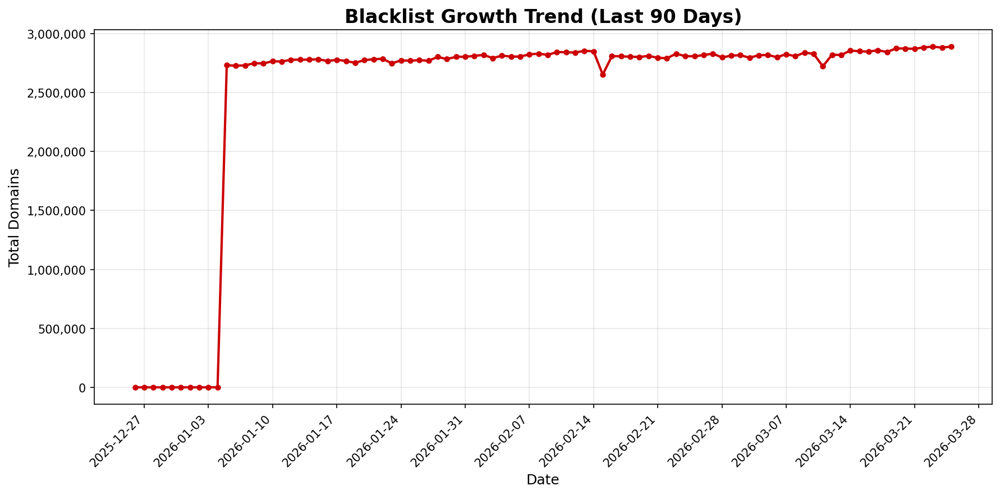

# Domains Blacklist

Daily updated domains blacklist.

## Downloads
- Pi-Hole, AdGuard, uBlock Origin: 
```
https://github.com/fabriziosalmi/blacklists/releases/download/latest/blacklist.txt
```

- Squid: **[blacklist.txt](https://github.com/fabriziosalmi/blacklists/releases/download/latest/blacklist.txt)** 
- Unbound: **[unbound_blacklist.txt](https://github.com/fabriziosalmi/blacklists/releases/download/latest/unbound_blacklist.txt)** 
- Bind, PowerDNS (RPZ): **[rpz_blacklist.txt](https://github.com/fabriziosalmi/blacklists/releases/download/latest/rpz_blacklist.txt)** 


    
<!-- STATS_START -->
## Daily Statistics

**Last Updated**: 2026-03-25 01:41 UTC

| Metric | Value |
|--------|-------|
| **Total Domains** | **2,890,227** |
| **Whitelisted** | 2,268 |
| **Sources** | 61 |
| **Daily Change** | +9,769 (+0.34%) |
| **Weekly Change** | +46,252 (+1.63%) |
| **Monthly Change** | +60,726 (+2.15%) |



*Statistics are automatically updated daily at midnight UTC*

<!-- STATS_END -->
### Compatibility
- **Windows**, **Mac**, **Linux** via the [uBlock Origin](https://github.com/gorhill/uBlock#ublock-origin) browser extension ([Firefox](https://addons.mozilla.org/it/firefox/addon/ublock-origin/) or [others browsers](https://ublockorigin.com))
- **iPhone** (Safari + DNS) via [AdGuard Pro for IOS](https://download.adguard.com/d/18672/ios-pro?exid=3ail29lmsdyc84s84c0gkosgo)
- **Android** via [AdGuard Pro for Android](https://adguard.com/it/adguard-android/overview.html)
- [PiHole](https://pi-hole.net/), [AdGuard Home](https://adguard.com/it/adguard-home/overview.html) and [Unbound](https://github.com/fabriziosalmi/blacklists/releases/tag/latest) **DNS filtering applications**
- **Proxies** like [Squid](http://www.squid-cache.org/), **firewalls** like [nftables](https://github.com/fabriziosalmi/blacklists/blob/main/scripts/nft_blacklist_fqdn.sh) and **WAF** like [OPNsense](https://docs.opnsense.org/manual/how-tos/proxywebfilter.html)
- **DNS servers** like [BIND9](https://github.com/fabriziosalmi/blacklists/tree/main/docs#how-to-implement-the-rpz-blacklist-with-bind9) or [PowerDNS](https://github.com/PowerDNS/pdns)
  
### Features
- **Daily Updates**: Aggregated and deduplicated daily from all configured sources
- **Multiple Formats**: Plain domain list (`blacklist.txt`), Unbound (`unbound_blacklist.txt`), BIND9 RPZ (`rpz_blacklist.txt`)
- **Broad Compatibility**: Works with Pi-Hole, AdGuard Home, Unbound, BIND9, Squid, nftables, uBlock Origin, and more
- **Whitelist Support**: [Submit domains for whitelisting](https://github.com/fabriziosalmi/blacklists/issues/new/choose)
- **Local Mirror**: Deploy using the [Docker image](https://hub.docker.com/repository/docker/fabriziosalmi/blacklists/)
- **FQDN Classifier**: A machine learning model to [predict bad domains](https://github.com/fabriziosalmi/fqdn-model) trained on this blacklist

## Contribute

- Propose additions or removals to the blacklist
- Enhance blacklist or whitelist processing
- Improve statistics and data analytics

## Credits

This project aggregates blacklists from numerous dedicated creators including:

[T145/BlackMirror](https://github.com/T145/black-mirror) - [Fabrice Prigent (UT1 mirror)](https://github.com/olbat/ut1-blacklists) - [1hosts](https://badmojr.gitlab.io/1hosts/Lite/domains.txt) - [PolishFiltersTeam](https://gitlab.com/PolishFiltersTeam/) - [ShadowWhisperer](https://raw.githubusercontent.com/ShadowWhisperer/BlockLists/) - [StevenBlack](https://raw.githubusercontent.com/StevenBlack/hosts/) - [bigdargon](https://raw.githubusercontent.com/bigdargon/hostsVN/master/hosts) - [developerdan](https://www.github.developerdan.com/) - [firebog](https://v.firebog.net/hosts/AdguardDNS.txt) - [hagezi](https://gitlab.com/hagezi/) - [malware-filter](https://malware-filter.gitlab.io/) - [phishfort](https://raw.githubusercontent.com/phishfort/phishfort-lists/master/blacklists/domains.json) - [phishing.army](https://phishing.army/) - [quidsup](https://gitlab.com/quidsup/) - [DandelionSprout](https://raw.githubusercontent.com/DandelionSprout/adfilt/) - [RPiList](https://raw.githubusercontent.com/RPiList/specials/master/Blocklisten/) - [What-Zit-Tooya](https://github.com/What-Zit-Tooya/Ad-Block) - [azet12](https://raw.githubusercontent.com/azet12/KADhosts) - [cert.pl](https://hole.cert.pl) - [mitchellkrogza](https://raw.githubusercontent.com/mitchellkrogza/Ultimate.Hosts.Blacklist) - [o0.pages.dev](https://o0.pages.dev) - [pgl.yoyo.org](https://pgl.yoyo.org/) - [lightswitch05](https://raw.githubusercontent.com/lightswitch05/hosts/) - [frogeye.fr](https://hostfiles.frogeye.fr/) - [fruxlabs](https://rescure.fruxlabs.com/) - [durablenapkin](https://raw.githubusercontent.com/durablenapkin/scamblocklist/) - [digitalside.it](https://osint.digitalside.it/Threat-Intel/lists/latestdomains.txt) - [malwareworld.com](https://malwareworld.com/)

and many more.

For a full list, check the [complete blacklists URLs](https://github.com/fabriziosalmi/blacklists/blob/main/blacklists.fqdn.urls).

Code improvements by [xRuffKez](https://github.com/xRuffKez), [hulores](https://github.com/hulores) and more.
