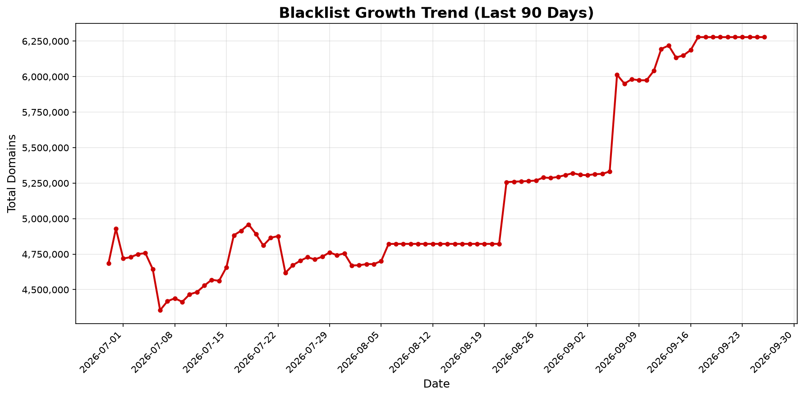

# Domains Blacklist

Daily updated domains blacklist, aggregated from curated upstream lists and
published with per-source attribution, verified licences and a public
false-positive cross-check.

> **What you are installing.** This is a single list, not a menu. Alongside
> advertising, tracking, malware and phishing it also blocks **gambling, piracy,
> streaming and adult** domains, because some upstream lists cover them. Roughly
> 6% of the list comes from the gambling, piracy and streaming sources alone, and
> a further **2.7% (about 143,000 domains) is adult content** - measured against
> the Universite Toulouse 1 Capitole reference list, since no upstream source
> here declares itself an adult blocklist. The live breakdown is published on the
> [site](https://fabriziosalmi.github.io/blacklists/#sources). If you want only
> the security categories, this list is not the right choice today.

## Downloads
- Pi-Hole, AdGuard, uBlock Origin: 
```
https://github.com/fabriziosalmi/blacklists/releases/download/latest/blacklist.txt
```

- Squid: **[blacklist.txt](https://github.com/fabriziosalmi/blacklists/releases/download/latest/blacklist.txt)** 
- Unbound: **[unbound_blacklist.txt](https://github.com/fabriziosalmi/blacklists/releases/download/latest/unbound_blacklist.txt)** 
- Bind, PowerDNS (RPZ): **[rpz_blacklist.txt](https://github.com/fabriziosalmi/blacklists/releases/download/latest/rpz_blacklist.txt)** 


<!-- These badges read the values published by the daily build, so they cannot
     go stale the way hardcoded numbers do. -->
[](https://fabriziosalmi.github.io/blacklists/#stats)
[](https://fabriziosalmi.github.io/blacklists/#sources)
[](whitelist.txt)
[](https://github.com/fabriziosalmi/blacklists/releases/tag/latest)
[](https://github.com/fabriziosalmi/blacklists/issues)
<!-- STATS_START -->
## Daily Statistics

**Last Updated**: 2026-08-29 01:17 UTC

| Metric | Value |
|--------|-------|
| **Total Domains** | **5,294,022** |
| **Whitelisted** | 2,080 |
| **Sources** | 46 |
| **Daily Change** | +7,629 (+0.14%) |
| **Weekly Change** | +36,792 (+0.70%) |
| **Monthly Change** | +551,838 (+11.64%) |



*Statistics are automatically updated daily at midnight UTC*

<!-- STATS_END -->
### Compatibility
- **Windows**, **Mac**, **Linux** via the [uBlock Origin](https://github.com/gorhill/uBlock#ublock-origin) browser extension ([Firefox](https://addons.mozilla.org/it/firefox/addon/ublock-origin/) or [others browsers](https://ublockorigin.com))
- **iPhone** (Safari + DNS) via [AdGuard Pro for IOS](https://download.adguard.com/d/18672/ios-pro?exid=3ail29lmsdyc84s84c0gkosgo)
- **Android** via [AdGuard Pro for Android](https://adguard.com/it/adguard-android/overview.html)
- [PiHole](https://pi-hole.net/), [AdGuard Home](https://adguard.com/it/adguard-home/overview.html) and [Unbound](https://github.com/fabriziosalmi/blacklists/releases/tag/latest) **DNS filtering applications**
- **Proxies** like [Squid](http://www.squid-cache.org/), **firewalls** like [nftables](https://github.com/fabriziosalmi/blacklists/blob/main/scripts/nft_blacklist_fqdn.sh) and **WAF** like [OPNsense](https://docs.opnsense.org/manual/how-tos/proxywebfilter.html)
- **DNS servers** like [BIND9](https://github.com/fabriziosalmi/blacklists/tree/main/docs#how-to-implement-the-rpz-blacklist-with-bind9) or [PowerDNS](https://github.com/PowerDNS/pdns)
  
### Features
- **Daily Updates**: Aggregated and deduplicated daily from all configured sources
- **Multiple Formats**: Plain domain list (`blacklist.txt`), Unbound (`unbound_blacklist.txt`), BIND9 RPZ (`rpz_blacklist.txt`)
- **Broad Compatibility**: Works with Pi-Hole, AdGuard Home, Unbound, BIND9, Squid, nftables, uBlock Origin, and more
- **Whitelist Support**: [Submit domains for whitelisting](https://github.com/fabriziosalmi/blacklists/issues/new/choose)
- **Local Mirror**: Deploy using the [Docker image](https://hub.docker.com/repository/docker/fabriziosalmi/blacklists/)
- **FQDN Classifier**: A machine learning model to [predict bad domains](https://github.com/fabriziosalmi/fqdn-model) trained on this blacklist

## Contribute

- Propose additions or removals to the blacklist
- Enhance blacklist or whitelist processing
- Improve statistics and data analytics

## Credits

This project would not exist without the maintainers of the upstream lists it
aggregates. Every source is redistributed under its own license. The full
per-source license and attribution map lives in **[SOURCES.md](SOURCES.md)**.

Upstream sources currently aggregated:

<!-- CREDITS_START -->
[AdGuard DNS filter](https://github.com/AdguardTeam/AdGuardSDNSFilter) ·
[DandelionSprout/adfilt](https://github.com/DandelionSprout/adfilt) ·
[EasyList](https://easylist.to/) ·
[FiltersHeroes/KADhosts](https://github.com/FiltersHeroes/KADhosts) ·
[LanikSJ/ubo-filters](https://github.com/LanikSJ/ubo-filters) ·
[ShadowWhisperer/BlockLists](https://github.com/ShadowWhisperer/BlockLists) ·
[StevenBlack/hosts](https://github.com/StevenBlack/hosts) ·
[The-Big-List-of-Hacked-Malware-Web-Sites](https://github.com/mitchellkrogza/The-Big-List-of-Hacked-Malware-Web-Sites) ·
[ThioJoe/YT-Spam-Lists](https://github.com/ThioJoe/YT-Spam-Lists) ·
[UT1 blacklists](https://dsi.ut-capitole.fr/blacklists/index_en.php) ·
[Ultimate.Hosts.Blacklist](https://github.com/Ultimate-Hosts-Blacklist/Ultimate.Hosts.Blacklist) ·
[What-Zit-Tooya/Ad-Block](https://github.com/What-Zit-Tooya/Ad-Block) ·
[badmojr/1Hosts](https://github.com/badmojr/1Hosts) ·
[bigdargon/hostsVN](https://github.com/bigdargon/hostsVN) ·
[dmachard/blocklist-domains](https://github.com/dmachard/blocklist-domains) ·
[durablenapkin/scamblocklist](https://github.com/durablenapkin/scamblocklist) ·
[eulaurarien (frogeye)](https://hostfiles.frogeye.fr/) ·
[fabriziosalmi/blacklists](https://github.com/fabriziosalmi/blacklists) ·
[hagezi/dns-blocklists](https://github.com/hagezi/dns-blocklists) ·
[jarelllama/Scam-Blocklist](https://github.com/jarelllama/Scam-Blocklist) ·
[lightswitch05/hosts](https://www.github.developerdan.com/hosts/) ·
[malware-filter](https://gitlab.com/malware-filter/malware-filter) ·
[matomo-org/referrer-spam-blacklist](https://github.com/matomo-org/referrer-spam-blacklist) ·
[oisd](https://oisd.nl/) ·
[phishfort/phishfort-lists](https://github.com/phishfort/phishfort-lists) ·
[phishunt.io](https://phishunt.io/) ·
[quidsup/notrack-blocklists](https://gitlab.com/quidsup/notrack-blocklists) ·
[stamparm/blackbook](https://github.com/stamparm/blackbook) ·
[uBlockOrigin/uAssets](https://github.com/uBlockOrigin/uAssets)
<!-- CREDITS_END -->

For the complete list of feed URLs, see [blacklists.fqdn.urls](https://github.com/fabriziosalmi/blacklists/blob/main/blacklists.fqdn.urls). For licenses and attribution, see [SOURCES.md](SOURCES.md).

Code improvements by [xRuffKez](https://github.com/xRuffKez), [hulores](https://github.com/hulores) and other contributors.

## License

The **aggregation tooling** in this repository (`generate.sh`, `sanitize.py`,
`whitelist.py`, and the scripts under `scripts/`) is
licensed under the **GNU General Public License v3.0** (see [`LICENSE`](LICENSE)).

The generated **`blacklist.txt`** (and the derived `rpz_blacklist.txt` and
`unbound_blacklist.txt`) is **not** covered by that license. It is an **aggregate**
that redistributes third-party domain lists, each under its own license and terms.
The published file carries an attribution header and points to
**[SOURCES.md](SOURCES.md)**, which maps every source to its license and the
attribution it requires.

If you are a rights holder and want a list changed or removed, please
[open an issue](https://github.com/fabriziosalmi/blacklists/issues/new/choose).
